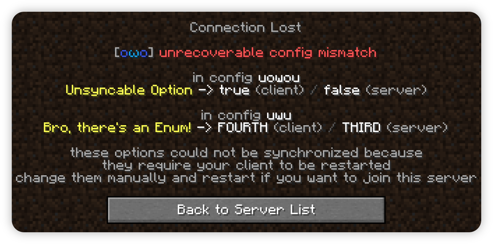

## The Concept
The majority of your config options are usually only used on one side - either the client or the server. Sometimes though, a server-side option may also affect client-side behavior in certain superficial ways, or it may even be strictly required that the client and server values match up. For these cases, owo-config supports server-client config synchronization - either for single values or even your entire config.

## Implementation
To enable config sync, simply apply the `@Sync` annotation to the option you want synchronized. When doing this, it is worth noting that the annotation cascades - that is, it applies to every option (or rather field) nested inside the one it was applied to as well. However, a more specific application always take priority - say you have sync enabled on your config class, you can then disable it for individual options and their children by applying the annotation to them again.

### Sync Modes 
 - `Option.SyncMode.NONE`: Quite self-explanatory, this is the default and makes it so the option is never synchronized in any way.

 - `Option.SyncMode.INFORM_SERVER`: This sync mode only sends the client's value to the server for later use via `ConfigSynchronizer.getClientOptions(...)`, but not the other way around. 

 - `Option.SyncMode.OVERRIDE_CLIENT`: Send the server's value to the client and temporarily override the client's value. Enabling `OVERRIDE_CLIENT` implies `INFORM_SERVER`

!!! info "Option Serialization"
    To send your config's value over the network, owo's networking stack is employed - specifically the `PacketBufSerializer` system. It *should* support all commonly used types out-of-the box, yet it is not impossible to think of a situation where you may need a custom serializer. For those cases, simply call `PacketBufSerializer.register(...)` **before** you load your config and provide the necessary code.

### Detached Options
When a client-side option gets overridden by the server, it enters the so-called "detached" state. In this state, it is essentially a dangling container for a value without any relation to its backing field. It will not get serialized when the config gets saved and any attempt made at modifying its value will fail. Should the player open the config screen while on a server, the option will appear as "managed by the server" and cannot be edited.

### Restart-only options
When `@Sync(Option.SyncMode.OVERRIDE_CLIENT)` is applied to a field which is also annotated as `@RestartRequired`, special handling is employed. Because such a value cannot be safely overridden by the server, the server's value is instead only used for verification. In case the client's value *does not match the server*, the client will automatically disconnect and prompt the user to change the value themselves and restart.

## Config Sync Flow
``` mermaid
graph LR
  A[Server] -->|Send values| B{Unrecoverable<br>Mismatch?};
  B -->|No| C((Connected));
  style C stroke:#00FFAB,stroke-width:4px

  C --> E[Respond with <br> local values];
  B --x|Yes| D[Connection <br>  aborted]; 
  style D stroke:#FF4949,stroke-width:4px
```
