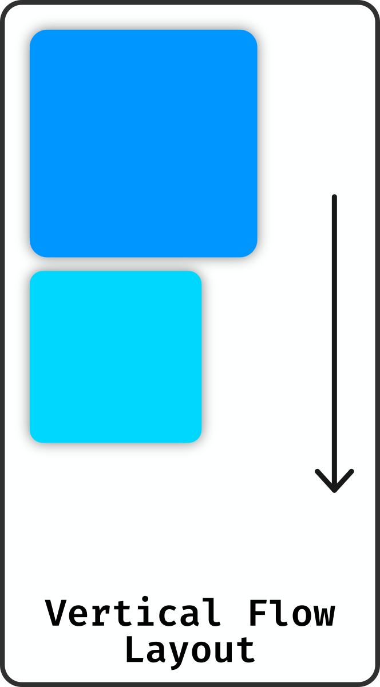
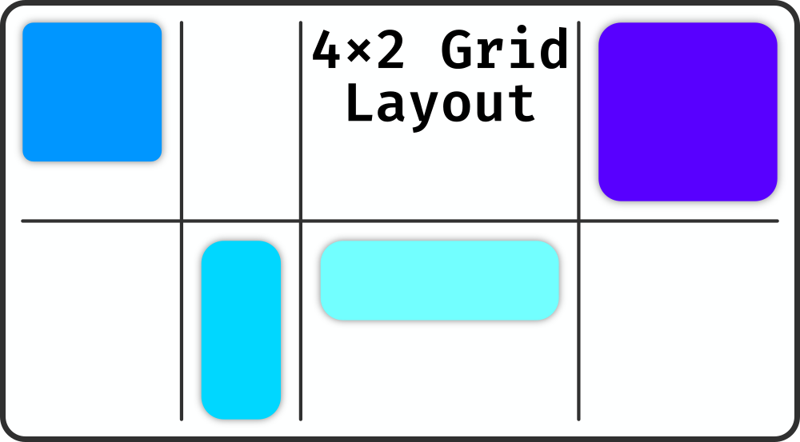

When building a UI, arranging components on screen is one of your primary tasks - in owo-ui, this is accomplished using layout components. A layout component is a parent component which accepts multiple children and places them on the screen in a certain fashion.

## Layout Types
owo-ui has two built-in layout components, which we'll explore now. Should neither of these meet your needs, you can always make your own - simply extend `BaseParentComponent`.

### Flow Layout
{ align=right style="--image-width: 20%;" .sized-image }

:material-xml: `#!xml <flow-layout direction="vertical|​horizontal">`  
:material-language-java: `#!java Containers.verticalFlow(...)` | `#!java Containers.horizontalFlow(...)`

The flow layout is the simplest layout you could possibly think of - as the name suggests, it simply places all children one after the other. Depending on the axis, components flow top-to-bottom or left-to-right in the order that they were added.

### Grid Layout
:material-xml: `#!xml <grid-layout rows="..." columns="...">` 
:material-language-java: `#!java Containers.grid(...)`

The grid layout is equally simple as the flow layout - it places every child in its own cell of a grid. The amount of rows and columns must be defined when you create the layout, as it internally represent the grid as a fixed-size array.

When a grid layout is content-sized, every row and column becomes as large as it needs to be to fit the largest cell. Otherwise, every row and column is evenly split along the layout's length in that direction.

{ style="--image-width: 60%; display: block; margin-right: auto; margin-left: auto;" .sized-image }

## Layout Properties

Every layout (in fact, all parent components) share some additional properties which normal components don't define. The ones relevant to layout are listed here.

### Alignment

The horizontal and vertical alignment of a parent component dictates where within itself the children should be positioned. For most components this is relative to the whole component, however the grid is an exception to this - children are always aligned relative to their respective cell.

### Padding

As explained in [component basics](component-basics.md#padding), all parent components define padding which is removed from the area available to their children. This is most useful in combination with a Surface, as it means you can add some extra visual breathing room around the children and make the border of your surface clearly visible.

### Overflow Clipping

While playing around with the framework, you may have encountered a situation under which a child component extends outside its parent without the protruding parts actually being rendered. This is due to overflow clipping - by default all parent components only allow rendering inside their bounding box. You can of course disable this and allow overflow to be rendered, although that generally leads to more problems than it solves.

A child which is completely invisible due to this is skipped entirely during rendering, which majorly improves performance with large scroll containers.