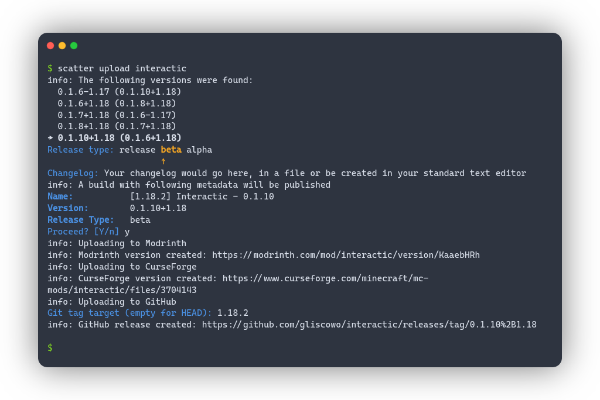

## What is scatter?



scatter is a command-line utility for distributing mods to hosting providers. Currently supported are CurseForge, Modrinth and GitHub Releases. After first-time setup, scatter uploads to all supported hosts in a single command

## Quick Start

Download the latest version of scatter from [Github Actions](https://github.com/gliscowo/scatter/actions) by clicking on the latest successful run and downloading the correct binary for your OS from the "Artifacts" section.

#### Configuring your tokens 

Run `scatter config --tokens`. You will be asked which platform to configure the token for, and then for the token itself. Whenever scatter asks you like this, use the arrow keys to make your selection.

```
→ scatter config --tokens
Platform: Modrinth CurseForge GitHub 
                              ↑
Token (empty to remove): 
info: Token for platform 'github' updated
```

#### Configuring default versions

So that you aren't asked on every upload, scatter stores a list of Minecraft versions with which each uploaded file is automatically considered compatible. Run `scatter config --default-versions`. A prompt will open in which you can edit the stored list.

```
→ scatter config --default-versions
info: Editing default versions. Prefix with '-' to remove a version, leave empty to exit
info: Use '-' to clear, '#' to display current default versions
info: Current default versions: []
Version: 1.18.2
info: Version '1.18.2' successfully added to default versions
Version: 
```

Should you ever want to upload a file that's compatible with a different set of Minecraft versions, use the `-o` flag when uploading.

#### Adding your first mod

To be able to upload a mod, scatter must know where it lives. Add your first mod to the database by running `scatter add <mod id>`. The prompt will take you through the setup process, after which you're ready to upload.

??? hint "A note about the "Artifact Location""
    When scatter asks for the "Artifact Location" during the setup process, it wants the folder where your mod's builds are stored. Usually this will be the `build/libs` directory in your project folder. The "Artifact Filename Pattern" is for discovering all relevant builds in that directory. It usually takes the form `modid-{}.jar`, which would, for example, match against `modid-2.5.7.jar`

#### Uploading your first file

Once all the steps above are completed, you're ready to upload. To do so, simply run `scatter upload <mod id>`. You'll be asked for which file to upload as well what type of release to create. Afterwards, you'll be asked to enter the changelog and verify what you just did. Then, scatter will upload the files, give you the URLs and exit.

#### **[Optional]** Configuring the default changelog mode

By default, scatter will open a file in your standard text editor into which you write your changelog. Should you prefer different behavior, you can use `scatter config --set-changelog-mode` to either make scatter load your changelog from a file called `changelog.md` or simple have a prompt in the console. 

You can always override this for a single upload by specifying `--changelog-mode <mode>`, where `<mode>` is either `editor`, `prompt` or `file`.